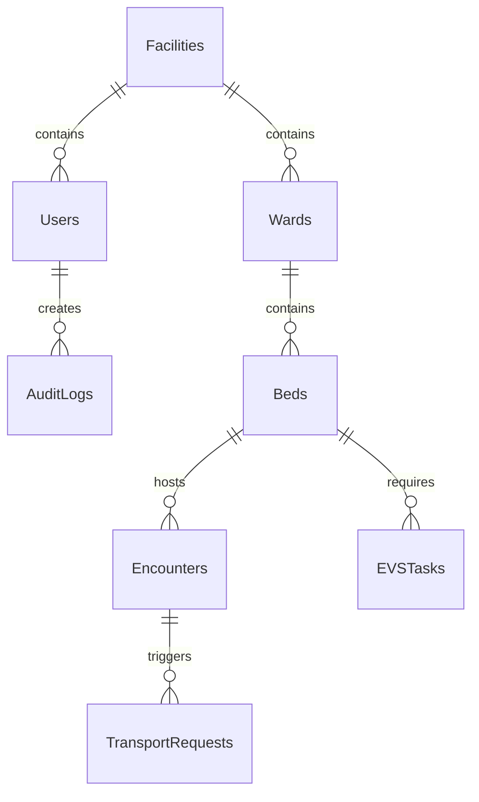

# Database Schema

SmartBed Flow utilizes a PostgreSQL relational database managed by SQLAlchemy and Alembic.

## Entity Relationship Overview

## Core Entities

### `User`
- **Purpose:** System authentication and authorization.
- **Primary Key:** `id` (UUID)
- **Important Fields:** `username`, `hashed_password`, `role` (Enum), `is_active`
- **Foreign Keys:** `facility_id` (isolates users to specific hospitals)

### `Facility`
- **Purpose:** Represents physical hospital campuses for data isolation.
- **Primary Key:** `id` (UUID)
- **Important Relationships:** One-to-Many with `Ward` and `User`.

### `Bed`
- **Purpose:** The core operational resource.
- **Primary Key:** `id` (UUID)
- **Important Status Fields:** `status` (Enum: `AVAILABLE`, `OCCUPIED`, `CLEANING`, `MAINTENANCE`)
- **Important Constraints:** Composite Unique Constraint on `(ward_id, bed_number)`.
- **Concurrency Protection:** Relies on SQLAlchemy `with_for_update()` row-locking during allocation routines.

### `Encounter`
- **Purpose:** Represents a patient's stay, tracking their clinical readiness lifecycle.
- **Primary Key:** `id` (UUID)
- **Important Status Fields:** `status` (Enum: `ADMITTED`, `DISCHARGED`, `TRANSFERRED`), `readiness_score` (Integer)
- **Foreign Keys:** `bed_id`, `patient_id` (synthetic identifier)
- **Important Relationships:** Linked directly to the `Bed` currently occupied.

### `EVSTask`
- **Purpose:** Tracks the environmental cleaning workflow for a bed.
- **Primary Key:** `id` (UUID)
- **Foreign Keys:** `bed_id`, `assigned_to`
- **Important Status Fields:** `status` (`PENDING`, `IN_PROGRESS`, `COMPLETED`), `quality_check_passed` (Boolean)

### `AuditLog`
- **Purpose:** Immutable tracking of consequential operational mutations (e.g., bed state changes, allocations).
- **Primary Key:** `id` (UUID)
- **Fields:** `action_type`, `user_id`, `resource_id`, `timestamp`

## Integrity Constraints & Concurrency

- **Facility Isolation:** Most major operational tables (Wards, Beds, Encounters) ultimately trace back to a `facility_id`. Read operations append `.filter(model.facility_id == current_user.facility_id)`.
- **Bed Allocation Concurrency:** The database strictly prevents double-booking an `AVAILABLE` bed through unique constraints on active encounters per bed, coupled with transaction-level locking.
- **Integration Idempotency:** Event gateways deduplicate incoming HL7/FHIR payloads using a unique constraint on external message identifiers.
- **Cascading Deletes:** Facilities strictly cascade deletes down to Wards and Beds, though operational records like Encounters and AuditLogs are soft-deleted or retained for compliance.
